<div align="center">

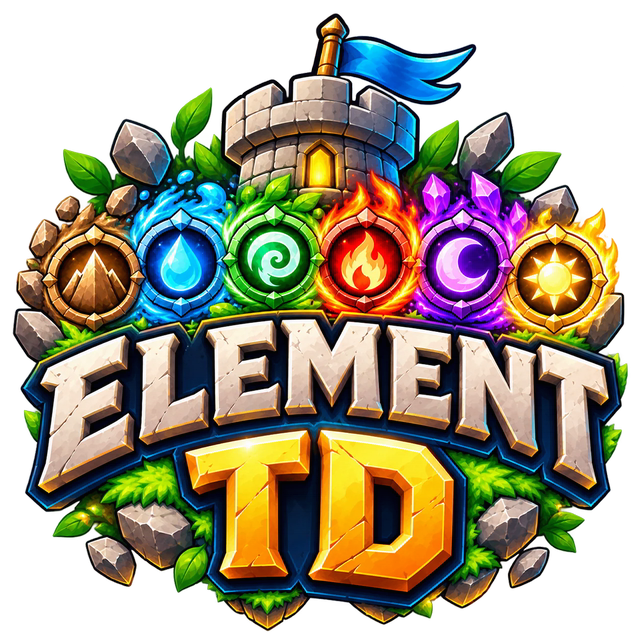

# Element TD 3D

**เกม Tower Defense สามมิติ หกธาตุ เล่นฟรีบนเบราว์เซอร์**
<br>3D elemental tower defense that runs in your browser, on desktop and mobile

[](https://elementtd.thasala.dev/)
[](CHANGELOG.md)


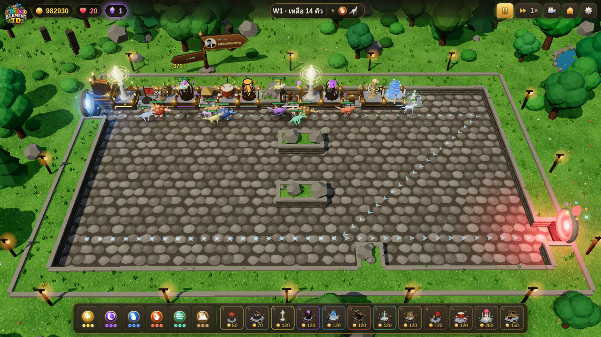

</div>

---

## เกี่ยวกับเกม

Element TD 3D ได้แรงบันดาลใจจาก Element TD ใน Warcraft III เรียกพลังของ **6 ธาตุ** มาสร้างป้อม หลอมรวมธาตุเป็นป้อมผสม **25 แบบ** วางเขาวงกตบังคับเส้นทางมอนสเตอร์ และปกป้องแกนกลางให้รอดครบ **100 เวฟ**

กราฟิก ป้อม มอนสเตอร์ และไอคอนทั้งหมดสร้างด้วยโค้ด ไม่มีไฟล์โมเดลจากภายนอก เปิดได้ทันทีบนเบราว์เซอร์ทั้งคอมและมือถือ

<table>
<tr>
<td width="33%">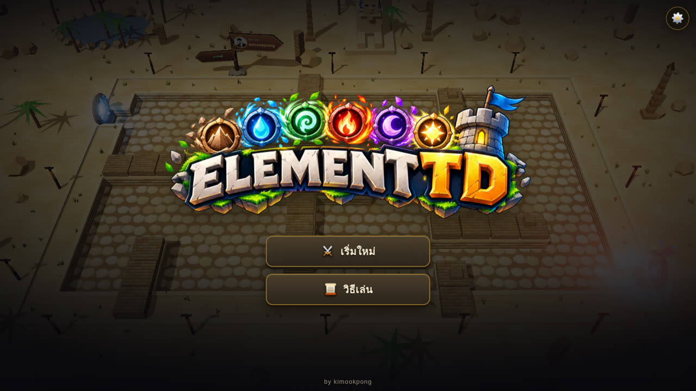</td>
<td width="33%">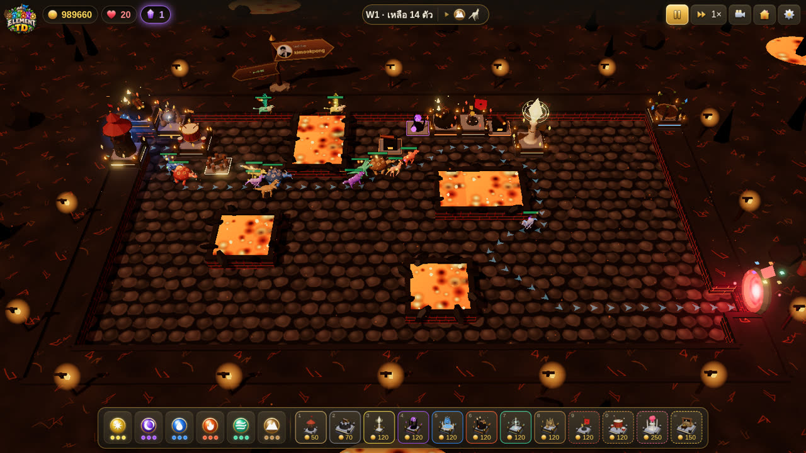</td>
<td width="33%">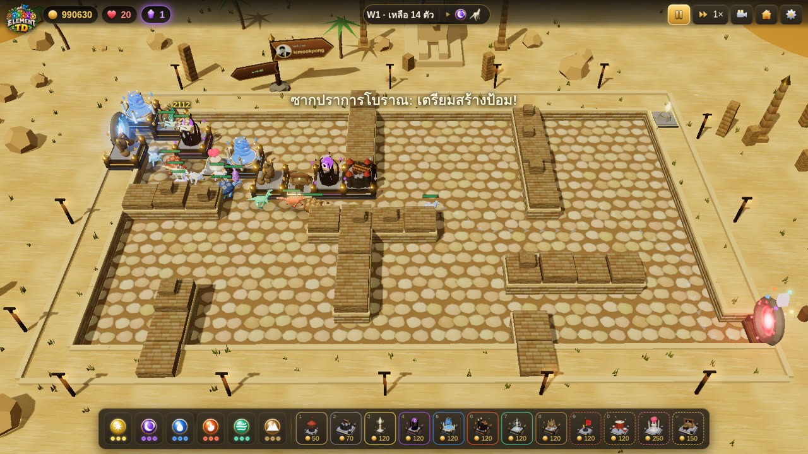</td>
</tr>
<tr>
<td align="center"><sub>หน้าจอเริ่มเกม</sub></td>
<td align="center"><sub>ภูเขาไฟลาวา (แผนที่ธาตุไฟ)</sub></td>
<td align="center"><sub>ซากปราการโบราณกลางทะเลทราย</sub></td>
</tr>
<tr>
<td>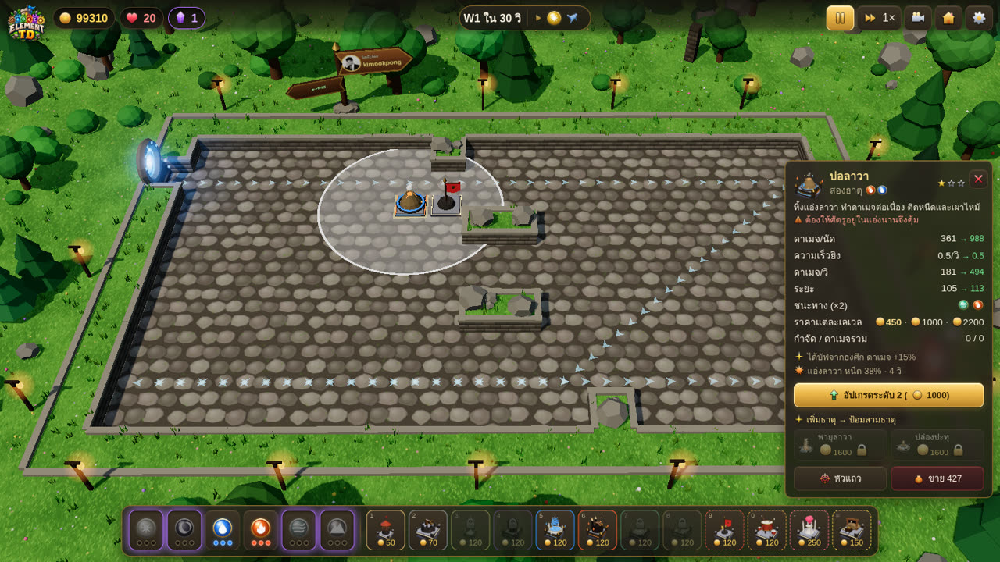</td>
<td>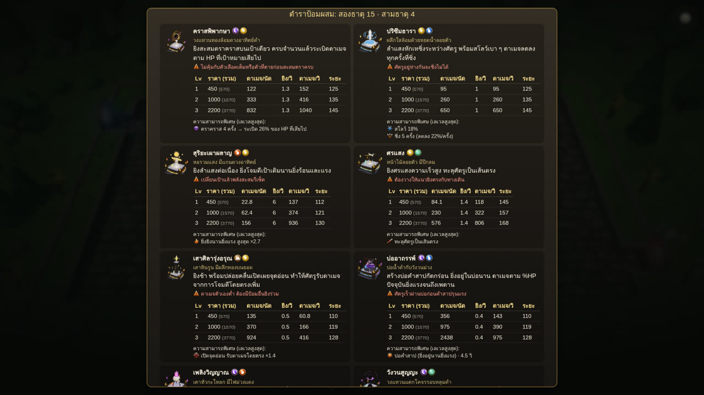</td>
<td>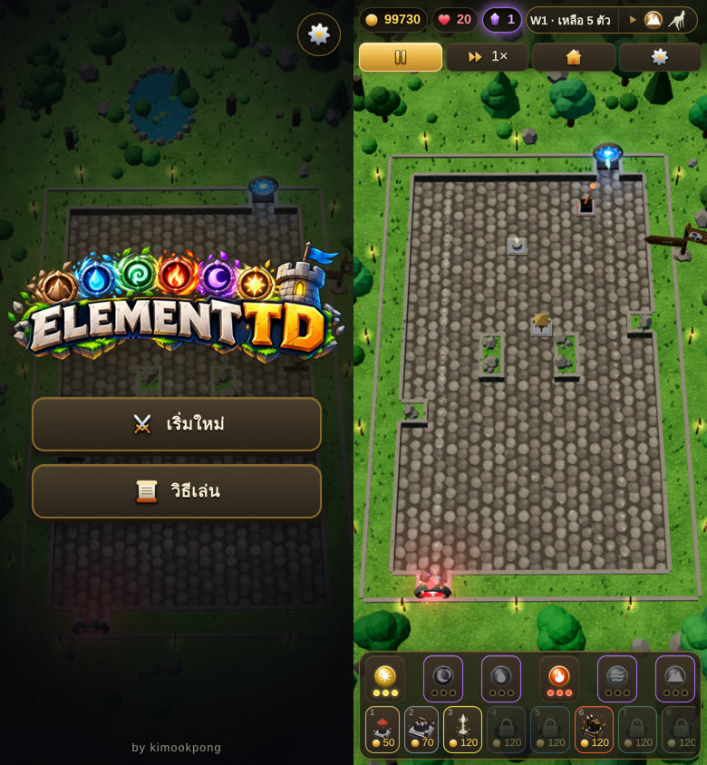</td>
</tr>
<tr>
<td align="center"><sub>การ์ดป้อม ค่าพลังและราคาทุกเลเวล</sub></td>
<td align="center"><sub>ตำราป้อมพร้อมตารางทุกเลเวล</sub></td>
<td align="center"><sub>เล่นบนมือถือแนวตั้ง</sub></td>
</tr>
</table>

## ออนไลน์ (v1.1.0)

- **เล่นแบบ Guest ได้ทันที** ไม่ต้องสมัคร แต่คะแนนจะไม่ถูกบันทึก
- **เข้าสู่ระบบด้วย Google** เพื่อเก็บประวัติ 10 เกมล่าสุด คะแนนสูงสุดของแต่ละแผนที่ และแก้ชื่อเล่นที่แสดงในอันดับได้
- **ป้ายอันดับ Top 5 ทุกแผนที่** อยู่บนฉากเกมฝั่งขวาบน และการ์ดเลือกแผนที่บอกคะแนนอันดับ 1 กับคะแนนของคุณ
- **คะแนน** = (เวฟที่เคลียร์ × 1000 + ชีวิตที่เหลือ × 100 + จำนวนที่ฆ่า) × ตัวคูณความยาก (ง่าย ×0.75, ปกติ ×1, ยาก ×1.5) เซิร์ฟเวอร์คิดคะแนนเองและตรวจว่าผลเกมเป็นไปได้จริงก่อนบันทึก

## จุดเด่น

| | | |
|---|---|---|
|  | **6 ธาตุ 25 ป้อม** | ธาตุเดี่ยว 6 ผสมสองธาตุ 15 ผสมสามธาตุ 4 แต่ละแบบมีโมเดล วิธีโจมตี และจุดอ่อนของตัวเอง |
|  | **ป้อมสนับสนุน 4 แบบ** | ธงศึก กลองศึก ศาลหัวใจ และเหมืองทอง ไม่ยิงแต่ช่วยบัฟ คืนชีวิต หรือหาทอง |
| 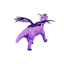 | **ภูตพิทักษ์ธาตุ** | ใช้ผลึกเรียกภูตธาตุออกมา ต้องกำจัดให้ได้ก่อนจึงปลดล็อกหรือเพิ่มเลเวลธาตุนั้น |
|  | **สร้างเขาวงกต** | บนลานหิน มอนสเตอร์หาทางเดินใหม่ทุกครั้งที่วางป้อม ลูกศรบนพื้นบอกเส้นทางสด ๆ |
|  | **8 แผนที่** | 4 แผนที่ทั่วไป และแผนที่ประจำธาตุ 4 แผนที่ที่ให้พลังถิ่น +15% |
|  | **เพลงประกอบ 13 เพลง** | เพลงประจำแต่ละแผนที่ เพลงบอส เพลงภูตธาตุ และเพลงชนะ/แพ้ |
|  | **บัญชีและอันดับ** | ล็อกอินด้วย Google เก็บประวัติ 10 เกมและคะแนนสูงสุด ชิงอันดับ Top 5 ของแต่ละแผนที่ หรือเล่นแบบ Guest ก็ได้ |
|  | **เล่นได้ทุกจอ** | รองรับเมาส์และนิ้วสัมผัส ติดตั้งเป็นแอปบนมือถือได้ บันทึกเกมอัตโนมัติ |
|  | **ไทย / English** | สลับภาษาได้ทุกเมื่อ หรือแชร์ลิงก์ `?lang=en` |

## วิธีเล่น

1. **วางป้อม** กดปุ่มป้อมด้านล่าง (หรือกด `1`–`9`, `0`, `-`, `=`) แล้วคลิกบนพื้น
2. **เรียกภูตธาตุ** กดที่ธาตุเพื่อใช้ผลึก 1 ชิ้น กำจัดภูตได้จึงปลดล็อกธาตุนั้น (ได้ผลึกเพิ่มทุก 5 เวฟ)
3. **อัปเกรดและผสมธาตุ** คลิกป้อมเพื่อดูค่าพลัง อัปเกรด หรือเพิ่มธาตุให้กลายเป็นป้อมผสม
4. **ใช้วงจรธาตุ** โจมตีธาตุที่ชนะทางได้ดาเมจ ×2 และโดนธาตุที่แพ้ทางลดเหลือ ×0.5

<p align="center">
 แสง ➜  มืด ➜  น้ำ ➜  ไฟ ➜  ลม ➜  ดิน ➜ 
</p>

### กติกาสำคัญ

- เวฟแรกมาหลังเริ่มเกม 30 วิ เวฟถัดไปมาเมื่อเคลียร์สนามหมดแล้ว 10 วิ
- มอนสเตอร์ทุกตัวที่หลุดถึงแกนกลางเสีย **1 ชีวิต** แล้ววนกลับไปเริ่มที่ประตูทางเข้าจนกว่าจะถูกกำจัด
- ฆ่าบอสมังกร (มาทุก 10 เวฟ) ได้ชีวิตคืน **+1**
- สร้างและอัปเกรดป้อมใช้เวลา ระหว่างก่อสร้างป้อมยิงไม่ได้
- จบเวฟได้โบนัสและดอกเบี้ย 3% ของทองที่เก็บไว้
- ผ่านเวฟ 100 แล้วเล่นต่อแบบไม่รู้จบได้

## ป้อมทั้งหมด

<details>
<summary><b>ป้อมพื้นฐานและป้อมสนับสนุน</b> (6 แบบ)</summary>

| | ป้อม | ราคา Lv1 / 2 / 3 | ความสามารถ |
|---|---|---|---|
| 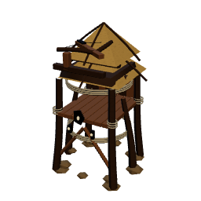 | **ป้อมธนู** | 50 / 60 / 150 | ยิงเร็ว เป้าเดียว ราคาถูก |
| 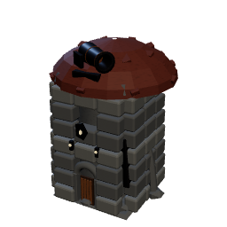 | **ป้อมปืนใหญ่** | 70 / 80 / 200 | ระเบิดวงกว้าง ยิงช้า |
| 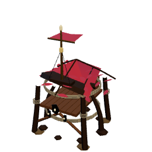 | **ธงศึก** | 120 / 150 / 250 | ป้อมในระยะดาเมจ +15 / 25 / 35% |
| 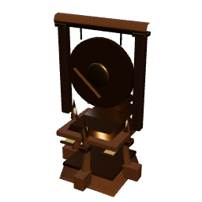 | **กลองศึก** | 120 / 150 / 250 | ป้อมในระยะยิงเร็ว +12 / 20 / 30% |
| 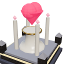 | **ศาลหัวใจ** | 250 / 300 / 450 | คืนชีวิต +1 ทุก 6 / 4 / 3 เวฟที่เคลียร์ (สร้างได้ 1 หลัง) |
| 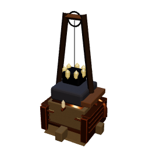 | **เหมืองทอง** | 150 / 200 / 350 | ได้ทอง ×0.5 / 1.1 / 2 ของ (10 + เลขเวฟ) ทุกเวฟ (สร้างได้ 4 หลัง) |

บัฟชนิดเดียวกันไม่ซ้อนกัน ป้อมจะได้ค่าที่สูงที่สุด

</details>

<details>
<summary><b>ป้อมธาตุเดี่ยว</b> (6 แบบ, ราคา 120 / 300 / 800)</summary>

| | ธาตุ | ป้อม | การโจมตี | จุดอ่อน |
|---|---|---|---|---|
|  |  | **สุริยเนตร** | ชาร์จลำแสงยิงเป้าเดียวได้ทั่วแผนที่ ดาเมจต่อครั้งสูง | ยิงช้ามาก รับมือฝูงไม่ดี |
| 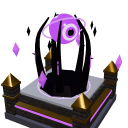 |  | **เนตรอเวจี** | ยิงพลังมืด กัดกร่อนตาม %HP ปัจจุบัน | คำสาปเบาลงเมื่อศัตรูเลือดน้อย |
| 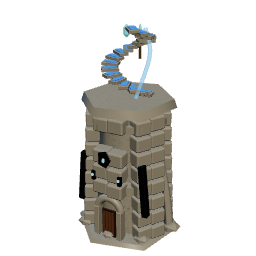 |  | **วังวนธารา** | ยิงน้ำกระจายเป็นวง ทำให้เปียกและช้าลง | ดาเมจต่ำ ต้องพึ่งป้อมอื่น |
| 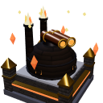 |  | **เตาอัคคี** | ลูกไฟระเบิดวงกว้าง เผาไหม้ต่อเนื่อง | กระสุนช้า ตัวเร็วหลบได้ |
| 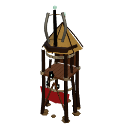 |  | **จักรวายุ** | ยิงรัวหลายเป้า สะสมลมผลักถอย | ดาเมจต่อเป้าต่ำ |
| 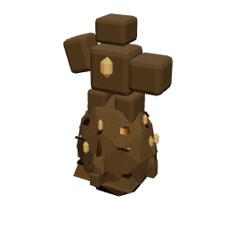 |  | **หมัดปฐพี** | ขว้างหินหนัก มีโอกาสมึนงง | ระยะสั้น ยิงช้า |

</details>

<details>
<summary><b>ป้อมผสมสองธาตุ</b> (15 แบบ)</summary>

| | ธาตุ | ป้อม | การโจมตี | จุดอ่อน |
|---|---|---|---|---|
| 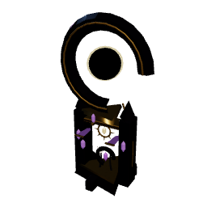 |   | **คราสพิพากษา** | สะสมตราคราส ครบแล้วระเบิดตาม HP ที่เสียไป | ไม่คุ้มกับตัวเลือดเต็ม |
| 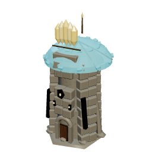 |   | **ปริซึมธารา** | ลำแสงชิ่งระหว่างศัตรู สโลว์เบา ๆ | ศัตรูห่างกันชิ่งไม่ได้ |
| 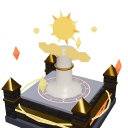 |   | **สุริยะเผาผลาญ** | ลำแสงต่อเนื่อง ยิ่งยิงนานยิ่งแรง | เปลี่ยนเป้าแล้วรีเซ็ต |
| 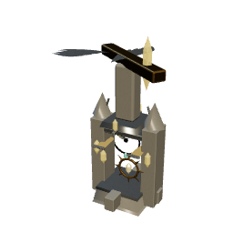 |   | **ศรแสง** | ศรแสงทะลุเป็นเส้นตรง | ต้องวางให้ตรงแนวทางเดิน |
| 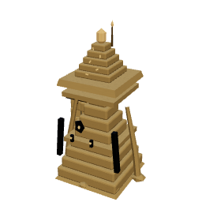 |   | **เสาศิลารุ่งอรุณ** | คลื่นเปิดจุดอ่อน ศัตรูรับดาเมจเพิ่ม | ดาเมจตัวเองต่ำ |
| 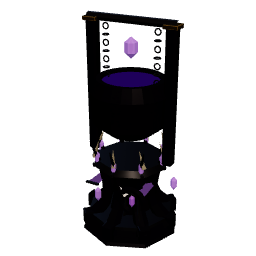 |   | **บ่ออาถรรพ์** | บ่อคำสาป ยิ่งอยู่นานยิ่งแรง | ตัวเร็วผ่านไปก่อน |
| 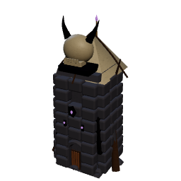 |   | **เพลิงวิญญาณ** | ไฟคำสาปแพร่ไปตัวข้าง ๆ เมื่อเป้าตาย | ศัตรูกระจายแล้วไม่คุ้ม |
| 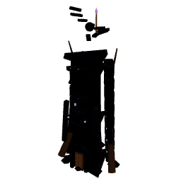 |   | **วังวนสูญญะ** | หลุมดำดึงศัตรูมารวมกัน | ดาเมจต่ำ บอสต้าน |
| 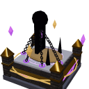 |   | **สุสานพันธนาการ** | ตรึงเป้าหมาย พร้อมกัดกร่อน | รอบโจมตีนาน |
| 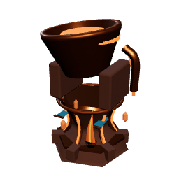 |   | **บ่อลาวา** | แอ่งลาวาหนืด เผาไหม้ | ต้องให้ศัตรูอยู่ในแอ่งนาน |
| 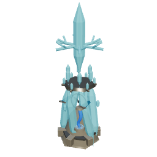 |   | **พายุเหมันต์** | สะสมความเย็นจนแช่แข็ง | ต้องใช้เวลาสะสม |
| 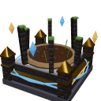 |   | **บึงดูด** | โคลนดูด ยิ่งอยู่นานยิ่งช้า | ดาเมจต่ำ |
| 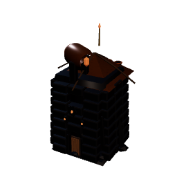 |   | **พายุเพลิง** | พายุไฟเคลื่อนตามทาง | พายุมีอายุจำกัด |
| 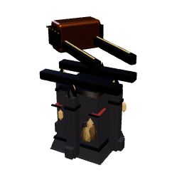 |   | **ปืนหลอมเกราะ** | กระสุนร้อนหนัก ทำเกราะแตก | ยิงช้า |
| 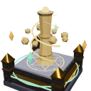 |   | **พายุทราย** | ยิงทรายเป็นกรวย ขัดจังหวะสกิล | ระยะสั้น |

</details>

<details>
<summary><b>ป้อมผสมสามธาตุ</b> (4 แบบ)</summary>

| | ธาตุ | ป้อม | การโจมตี |
|---|---|---|---|
| 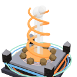 |    | **พายุลาวา** | พายุลาวาเคลื่อนตามทาง ทิ้งแอ่งไว้ด้านหลัง |
| 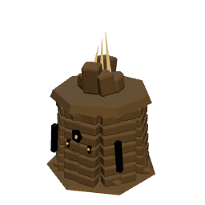 |    | **ปล่องปะทุ** | จุดปะทุหน่วงเวลา ระเบิดแรงและทำให้มึนงง |
| 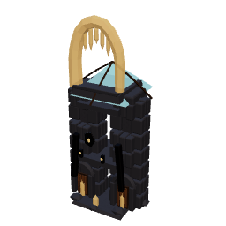 |    | **ธารน้ำแข็ง** | แช่แข็ง แล้วยิงซ้ำให้น้ำแข็งแตกเป็นวง |
| 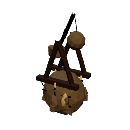 |    | **ฝนอุกกาบาต** | ระดมหินไฟลงพื้นที่ |

</details>

ตัวเลขดาเมจ ความเร็วยิง ระยะ และราคาของทุกเลเวลดูได้ในหน้า **วิธีเล่น** ในเกม

## มอนสเตอร์

| | มอนสเตอร์ | HP | ความเร็ว | เกราะ | ความสามารถ |
|---|---|---|---|---|---|
| 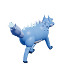 | **หมาป่าคริสตัล** | ×1 | 46 | 0% | มอนสเตอร์ธรรมดา |
| 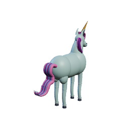 | **ยูนิคอร์น** | ×0.6 | 80 | 0% | เคลื่อนที่เร็วมาก |
| 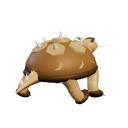 | **เต่ามังกร** | ×1.3 | 34 | 20% | ไม่ติดสถานะชะลอ มึนงง ผลัก |
| 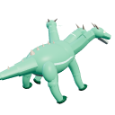 | **ไฮดรา** | ×1 | 44 | 0% | ฟื้นพลังชีวิต 2.5% ต่อวินาที |
| 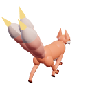 | **คิทสึเนะ** | ×0.75 | 42 | 0% | ตายแล้วแยกร่างเป็น 2 ตัว |
| 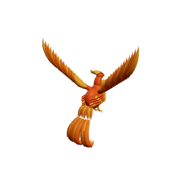 | **ฟีนิกซ์** | ×0.8 | 44 | 0% | ฟื้นคืนชีพหนึ่งครั้งด้วย HP 50% |
| 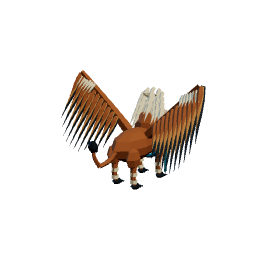 | **กริฟฟิน** | ×0.6 | 42 | 0% | บินข้ามเขาวงกต |
|  | **มังกรโบราณ (บอส)** | ×12 | 26 | 0% | ต้านสถานะ ฆ่าได้ชีวิตคืน +1 |
|  | **ภูตพิทักษ์ธาตุ** | ×5 / 10 / 16 | 36 | 0% | เรียกด้วยผลึก กำจัดเพื่อปลดล็อกธาตุ |

ธาตุของมอนสเตอร์สุ่มในแต่ละเวฟ HP พื้นฐานโต 17% ต่อเวฟถึงเวฟ 30 จากนั้นโตตามทองที่ผู้เล่นหาได้ (เวฟ 100 ราว 16 เท่าของเวฟ 30)

## แผนที่

| แผนที่ | แบบ | จุดเด่น |
|---|---|---|
| ลานวงกตแห่งทุ่งหญ้า | เขาวงกต | สนามเปิด วางป้อมสร้างทางเดินเอง |
| ซากปราการโบราณ | เขาวงกต | ทะเลทราย พีระมิด สฟิงซ์ จุดตรวจ 2 จุด |
| หุบเขาคดเคี้ยว | ทางตายตัว | สร้างบนสันเขาริมทาง |
| วังวนแห่งห้วงมืด | ทางตายตัว | ทางวนสั้นยามค่ำคืน (ยาก) |
| ภูเขาไฟลาวา  | เขาวงกต | ธารลาวาและภูเขาไฟพ่นควัน |
| แม่น้ำไหลวน  | ทางตายตัว | สายน้ำคดเคี้ยว 4 ชั้น |
| ก้อนเมฆ  | เขาวงกต | เกาะเมฆลอยฟ้า มีช่องโหว่มองเห็นท้องฟ้า |
| ใต้ดิน  | ทางตายตัว | ถ้ำคริสตัลและเห็ดเรืองแสง |

แผนที่ประจำธาตุ: มอนสเตอร์ธาตุนั้นมาบ่อย และป้อมที่มีธาตุนั้นได้พลังถิ่น +15%

## การควบคุม

| การกระทำ | เมาส์ | มือถือ |
|---|---|---|
| วางป้อม / เลือกป้อม | คลิกซ้าย | แตะ |
| เลื่อนกระดาน | คลิกซ้ายค้างแล้วลาก | นิ้วเดียวลาก |
| หมุนกล้อง | คลิกขวาค้างแล้วลาก | สองนิ้วลาก |
| ซูม | ล้อเมาส์ | บีบสองนิ้ว |

| คีย์ | การทำงาน | คีย์ | การทำงาน |
|---|---|---|---|
| `1`–`9` `0` `-` `=` | เลือกป้อม | `U` | อัปเกรด |
| `Space` / `P` | หยุด / เล่นต่อ | `S` | ขาย |
| `F` | ความเร็ว | `T` | โหมดเล็งเป้า |
| `M` | ปิด/เปิดเสียง | `O` | ตั้งค่า |
| `L` | เปลี่ยนภาษา | `C` | รีเซ็ตกล้อง |
| `Z` | เต็มจอ | `Esc` | ยกเลิก |

## เพลงประกอบ

| เพลง | ใช้ตอน |
|---|---|
| Six Elements Rise | หน้าจอเริ่มเกม |
| Meadow Maze · Sands of the Sphinx · Winding Canyon · Abyss Spiral | 4 แผนที่ทั่วไป |
| Heart of the Molten Peak · Currents of the Endless River · Kingdom Above the Clouds · Depths of the Stone Kingdom | 4 แผนที่ประจำธาตุ |
| Guardian of the Elements | ภูตพิทักษ์ธาตุอยู่ในสนาม |
| Wrath of the Ancient Dragon | บอสมังกรอยู่ในสนาม |
| Victory of Six Elements · The Core Has Fallen | ชนะ / แพ้ |

## สำหรับนักพัฒนา

ต้องใช้ Node.js 20 ขึ้นไป

```bash
npm install
npm run dev       # เปิดเซิร์ฟเวอร์พัฒนา http://localhost:5173
npm run build     # สร้างไฟล์สำหรับขึ้นเว็บไว้ใน dist/
npm run preview   # เปิดดูไฟล์ที่ build แล้ว
```

`npm run dev` ไม่มี API จึงเล่นได้แบบ Guest อย่างเดียว ถ้าจะทดสอบล็อกอิน คะแนน และอันดับ ให้ใช้ `npm run worker:dev` ด้านล่าง

### รันบน Cloudflare (เกม + ระบบออนไลน์)

เกมและ API รันบน Cloudflare Workers ข้อมูลผู้เล่นเก็บใน D1 (`element-td-db`) ตั้งค่าอยู่ใน `wrangler.toml`

```bash
npm run worker:dev   # build, สร้างตาราง D1 ในเครื่อง แล้วรัน Worker ที่ http://localhost:8787
npm run deploy       # build, อัปเดตตาราง D1 และ deploy ขึ้น elementtd.thasala.dev
```

ทดสอบในเครื่องโดยไม่ต้องใช้ Google: สร้างไฟล์ `.dev.vars` ใส่ `DEV_LOGIN=1` แล้วในหน้าบัญชีจะมีปุ่ม dev login

**ตั้งค่าล็อกอิน Google (ครั้งเดียว)**
1. Google Cloud Console > APIs & Services > Credentials > Create OAuth client ID ชนิด **Web application**
2. Authorized JavaScript origins ใส่ `https://elementtd.thasala.dev` (ทดสอบในเครื่องเพิ่ม `http://localhost:8787`)
3. นำ Client ID ไปใส่ `GOOGLE_CLIENT_ID` ใน `wrangler.toml` แล้ว deploy ใหม่ (ไม่ต้องใช้ Client Secret)

**Deploy** สั่ง `npm run deploy` จากเครื่อง ต้อง `npx wrangler login` ด้วยบัญชี Cloudflare ที่มีโดเมน thasala.dev (บัญชีเดียวกับ `account_id` ใน `wrangler.toml`) ไม่มี GitHub Actions deploy ขึ้น Cloudflare ให้แล้ว ส่วน GitHub Pages ยัง deploy อัตโนมัติทุกครั้งที่ push ขึ้น `main` แต่เล่นได้แบบ Guest อย่างเดียวเพราะไม่มี API

ถ้าเปลี่ยนเวอร์ชันใน `package.json` และเพิ่มไฟล์ `docs/releases/v<เวอร์ชัน>.md` ระบบจะสร้าง tag และ Release ของเวอร์ชันนั้นให้เอง

### API

| Method | Path | ใช้ทำอะไร |
|---|---|---|
| GET | `/api/config` | Client ID ของ Google และจำนวนผู้เล่นที่ลงทะเบียน (โชว์ที่ footer หน้าแรก) |
| POST | `/api/auth/google` | เข้าสู่ระบบด้วย ID token ได้ session token กลับมา |
| GET / PATCH | `/api/me` | โปรไฟล์ ประวัติ 10 เกม คะแนนสูงสุด / แก้ชื่อเล่น |
| POST | `/api/runs` | เริ่มรอบเล่น |
| POST | `/api/runs/:id/finish` | ส่งผลเกม (เซิร์ฟเวอร์ตรวจและคิดคะแนนเอง) |
| GET | `/api/leaderboard?map=` | Top 5 ของแผนที่ และอันดับของตัวเอง |
| GET | `/api/summary` | อันดับ 1 ของทุกแผนที่ (การ์ดเลือกแผนที่) |

### ข้อมูลที่เก็บ

เก็บเฉพาะรหัสบัญชี Google, ชื่อที่แสดง, รูปโปรไฟล์ และผลเกม ไม่เก็บอีเมล ผู้เล่นแบบ Guest ไม่มีข้อมูลใดถูกส่งออกจากเครื่อง

<details>
<summary><b>โครงสร้างโค้ด</b></summary>

```
index.html          หน้าเกม, UI และ SEO
src/main.js         UI, อินพุต, ลูปหลัก
src/sim.js          ตรรกะเกมทั้งหมด (pathfinding, ป้อม, มอนสเตอร์, เวฟ) ไม่ขึ้นกับการเรนเดอร์
src/data.js         ธาตุ, ป้อมพื้นฐาน/สนับสนุน, มอนสเตอร์, แผนที่ (ปรับสมดุลที่นี่)
src/towers.js       ข้อมูลป้อมธาตุ 25 แบบ
src/render3d.js     ตัวเรนเดอร์ Three.js: กล้อง, อนุภาค, ซิงก์วัตถุจาก sim
src/world.js        สร้างฉาก: ภูมิประเทศ, กำแพง, พอร์ทัล, ของตกแต่ง, ป้ายผู้สร้าง
src/models.js       โมเดลป้อม (ฐานตามระดับ + แคชแม่แบบ)
src/towerHeads.js   โมเดลหัวป้อมธาตุ 25 แบบ
src/creatures.js    สัตว์ในเทพนิยาย 8 แบบ พร้อมโครงกระดูกและแอนิเมชัน
src/vfx.js          เอฟเฟกต์การโจมตีพิเศษ (แอ่ง, พายุ, อุกกาบาต, ลำแสงชิ่ง)
src/modelkit.js     เครื่องมือปั้นโมเดล procedural
src/textures.js     พื้นผิว procedural
src/i18n.js         ระบบ 2 ภาษา
src/audio.js        เสียงเอฟเฟกต์ (WebAudio)
src/music.js        เพลงประกอบ (วนซ้ำ + เฟดข้ามเพลง)
src/api.js          เชื่อมต่อ API ล็อกอิน และส่งผลเกม (เก็บไว้ส่งใหม่ถ้าเน็ตหลุด)
src/score.js        สูตรคะแนนและการตรวจผลเกม (ใช้ร่วมกับ Worker)
worker/index.js     Cloudflare Worker: API + เสิร์ฟไฟล์เกม
migrations/         ตารางฐานข้อมูล D1
wrangler.toml       ตั้งค่า Cloudflare (D1, โดเมน, Google Client ID)
src/style.css       สไตล์ UI
public/music/       ไฟล์เพลง
public/icons/       ไอคอน PNG ที่สร้างด้วยโค้ด
tools/icons.html    หน้าสร้างไอคอน (node tools/export-icons.cjs ขณะเปิด npm run dev)
docs/screenshots/   ภาพประกอบ README
docs/releases/      บันทึกการเปลี่ยนแปลงของแต่ละ Release
LICENSE / NOTICE    MIT สำหรับโค้ด / ขอบเขตลิขสิทธิ์ของเพลงและภาพ
```

แผนที่เขียนเป็นตัวอักษร 20×12 ใน `src/data.js`:
`.` ลานหิน (เดินได้และสร้างได้) · `#` เนินหญ้า (สร้างได้) · `=` ทางเดิน · `R` โขดหิน · `W` ซากกำแพง · `X` หลุม/ลาวา · `S` จุดเกิด · `C` แกนกลาง · `1`–`9` จุดตรวจ

</details>

## English

**Element TD 3D** is a free 3D tower defense game inspired by the Warcraft III Element TD map. Summon elemental guardians to unlock six elements, fuse them into 25 unique towers, add support towers that buff, heal or earn gold, build mazes and hold the core for 100 waves. Sign in with Google to keep your history and climb each map's Top 5, or play as a guest. Everything is procedural, built with Three.js and Vite, and it plays on desktop and mobile in Thai or English.

[Play now](https://elementtd.thasala.dev/?lang=en) · [Changelog](CHANGELOG.md)

## License

โค้ดใช้สัญญาอนุญาต [MIT](LICENSE) นำไปใช้หรือดัดแปลงได้ ส่วนเพลง โลโก้ ไอคอน และภาพใน `public/` กับ `docs/screenshots/` สงวนลิขสิทธิ์ ห้ามนำไปใช้นอกโปรเจกต์นี้โดยไม่ได้รับอนุญาต

The code is [MIT licensed](LICENSE). Music, logos, icons and images in `public/` and `docs/screenshots/` are all rights reserved; see [NOTICE](NOTICE) for details.

---

<div align="center">

ไอเดียและพัฒนาโดย **[kimookpong](https://kimookpong.github.io/)**

</div>
